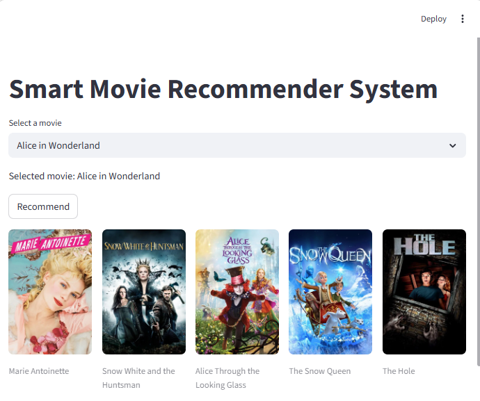
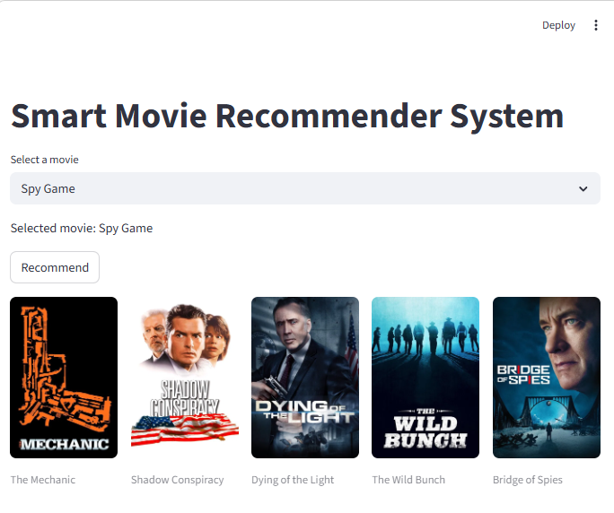

# Smart Movie Recommender System


[](https://hub.docker.com/r/datadoodle14/movie-recommender)

A content-based movie recommender system built with NLP and Streamlit.  
Recommends movies similar to a selected title using **TF-IDF vectorization** and **cosine similarity**.


---

## Screenshots

| Recommendation_1 | Recommendation_2 |
|------|-----------------|
|  |  |

---

## Features

- Content-Based Filtering using movie metadata
- TF-IDF Vectorization over combined features (overview, genres, keywords, cast, director)
- Cosine Similarity for ranking recommendations
- O(1) lookup with optimized dictionary indexing
- Movie posters fetched via TMDB API
- Clean and responsive Streamlit UI

---

## How It Works

1. Movie metadata (overview, genres, keywords, cast, director) is merged and preprocessed.
2. Weighted feature engineering boosts recommendation quality.
3. Text is vectorized using TF-IDF.
4. A cosine similarity matrix is computed across all movies.
5. Top 5 most similar movies are returned with posters.

---

## Tech Stack

| Layer | Tools |
|-------|-------|
| Language | Python 3.10 |
| Data Processing | Pandas, NLTK |
| ML / Similarity | Scikit-learn |
| Frontend | Streamlit |
| External API | TMDB API |
| Containerization | Docker |

---

## Setup & Installation

### Prerequisites
- Python 3.10+
- A [TMDB API key](https://www.themoviedb.org/settings/api)

### Steps

```bash
# 1. Clone the repo
git clone https://github.com/DataDoodle14/Movie_Recommendation_Engine_Content_based_Filtering.git
cd Movie_Recommendation_Engine_Content_based_Filtering

# 2. Install dependencies
pip install -r requirements.txt

# 3. Add your API key
echo "API_KEY=your_api_key_here" > .env

# 4. Generate model files (run notebook)
jupyter notebook notebook/content_based_filtering.ipynb

# 5. Launch the app
streamlit run app.py
```

---

### Run with Docker (No Setup Needed!)

```bash
# Pull the image from Docker Hub
docker pull datadoodle14/movie-recommender

# Run the app
docker run -p 8501:8501 datadoodle14/movie-recommender
```

Then open `http://localhost:8501` in your browser.

> Docker image available at: [hub.docker.com/r/datadoodle14/movie-recommender](https://hub.docker.com/r/datadoodle14/movie-recommender)

---

## Project Structure

```
Movie_Recommendation_Engine_Content_based_Filtering/
├── data/
│   ├── tmdb_5000_credits.csv
│   └── tmdb_5000_movies.csv
├── model/
│   ├── movies.pkl
│   └── similarity.pkl
├── notebook/
│   └── content_based_filtering.ipynb
├── screenshots/
│   ├── app_preview_1.png
│   └── app_preview_2.png
├── app.py
├── Dockerfile
├── requirements.txt
├── .env
├── .gitignore
└── README.md
```

---

## Future Improvements

- [ ] Hybrid recommendation (content + collaborative filtering)
- [ ] User rating-based filtering
- [ ] Trending movies section using TMDB's trending API

---

## Dataset

[TMDB 5000 Movie Dataset](https://www.kaggle.com/datasets/tmdb/tmdb-movie-metadata) — via Kaggle

---

## License

This project is open source and available under the [MIT License](LICENSE).
